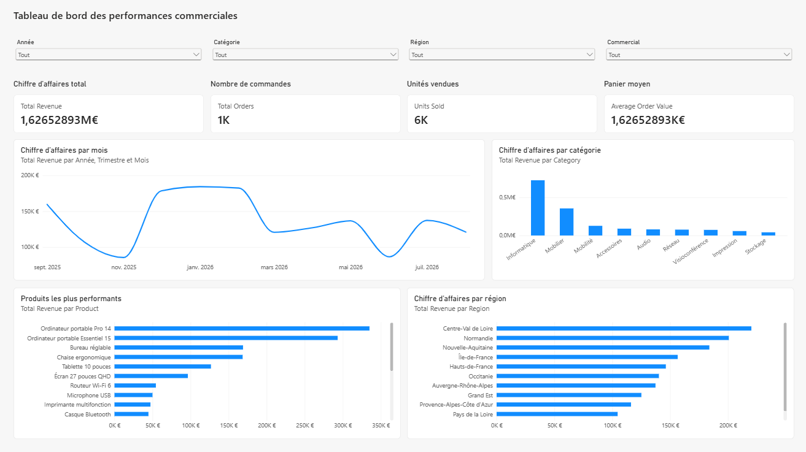

# Tableau de bord des ventes

Projet de portfolio réalisé avec Power BI pour explorer les ventes par produit, catégorie, région et commercial en France.



## Présentation

Le rapport utilise un fichier CSV synthétique de 1 000 commandes réparties sur environ douze mois. Il contient des produits, catégories, villes et régions françaises, commerciaux et types de clients. Les prix et quantités sont générés pour la démonstration et ne représentent pas des transactions réelles.

Power Query importe le CSV UTF-8, transforme la première ligne en en-têtes et applique les types adaptés. Une colonne calculée `Revenue` multiplie le prix unitaire par la quantité.

## Contenu du tableau de bord

Quatre indicateurs principaux présentent le chiffre d'affaires, le nombre de commandes, les unités vendues et le panier moyen. Des graphiques détaillent l'évolution mensuelle, les catégories, les régions et les produits les plus performants. Des segments filtrent le rapport par date, catégorie, région et commercial.

Les mesures DAX utilisées sont :

```DAX
Total Revenue = SUM(Sales[Revenue])
Total Orders = DISTINCTCOUNT(Sales[OrderID])
Units Sold = SUM(Sales[Quantity])
Average Order Value = DIVIDE([Total Revenue], [Total Orders])
```

## Technologies

- Power BI Desktop ;
- Power Query ;
- DAX ;
- visualisation de données.

## Organisation du dépôt

```text
powerbi-sales-dashboard/
├── data/
│   ├── sales.csv                     # Données sources synthétiques
│   ├── SalesDashboard.pbip           # Point d'entrée du projet Power BI
│   ├── SalesDashboard.Report/        # Définition du rapport
│   └── SalesDashboard.SemanticModel/ # Modèle et mesures DAX
├── screenshots/
│   └── dashboard.png                 # Aperçu du tableau de bord
├── LICENSE
└── README.md
```

Pour ouvrir le rapport, lancer `data/SalesDashboard.pbip` dans Power BI Desktop. Si le fichier CSV a été déplacé, mettre à jour son chemin dans Power Query.
